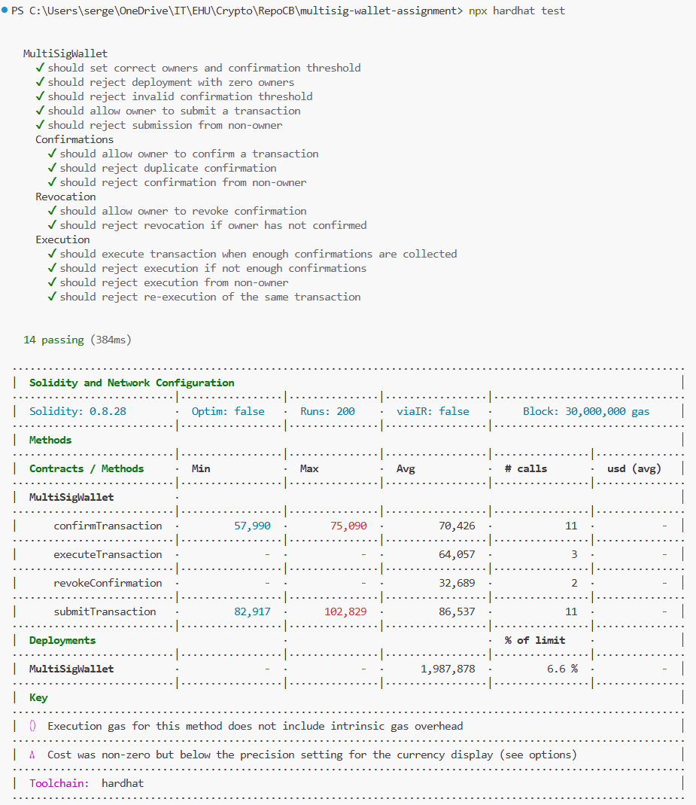

# **Multi-Signature Wallet — Documentation Report**

## **1. Introduction**

Multi-signature (multi-sig) wallets are a critical security primitive in blockchain systems.
They require multiple independent owners to approve a transaction before it can be executed.
This mechanism provides enhanced protection against:

* private key theft,
* rogue actors,
* governance risks,
* accidental transfers.

This project implements a secure and fully tested multi-sig wallet smart contract in Solidity.
The solution includes:

* Solidity smart contract
* Automated test suite (Hardhat + Mocha + Chai)
* Deployment script
* Security analysis

---

## **2. Architecture Overview**

The multi-sig wallet supports the following workflow:

1. **Owners submit a transaction**
   A transaction includes:

   * `to` — recipient address
   * `value` — ether amount
   * `data` — calldata (optional)

2. **Owners confirm the transaction**
   Each owner must explicitly confirm the transaction.

3. **Threshold check**
   The transaction becomes executable only after the required number of confirmations.

4. **Execution**
   Any owner can execute the transaction once the confirmation threshold is met.

5. **Revocation**
   Owners may revoke their confirmation before execution.

The contract does not allow:

* duplicate confirmations
* confirmations from non-owners
* execution without sufficient confirmations
* re-execution of the same transaction

---

## **3. Contract Features**

### **3.1 Owners & Access Control**

* Owner list set during deployment.
* Mapping `isOwner` enables O(1) access control.
* Custom modifiers:

  * `onlyOwner`
  * `txExists`
  * `notExecuted`
  * `notConfirmed`

### **3.2 Transaction Lifecycle**

Each transaction is represented by a struct:

```solidity
struct Transaction {
    address to;
    uint256 value;
    bytes data;
    bool executed;
    uint256 numConfirmations;
}
```

The workflow includes:

* `submitTransaction()`
* `confirmTransaction()`
* `revokeConfirmation()`
* `executeTransaction()`

### **3.3 Events**

For transparency and ease of off-chain indexing, the contract emits:

* `SubmitTransaction`
* `ConfirmTransaction`
* `RevokeConfirmation`
* `ExecuteTransaction`
* `Deposit`

---

## **4. Implementation Summary**

### Technologies Used:

* **Solidity 0.8.20**
* **Hardhat 2**
* **Ethers.js v6**
* **Mocha & Chai**
* **Local Hardhat network**

### Smart Contract Safety Techniques:

* Checks-Effects-Interactions pattern
* Input validation
* Prevention of double execution
* Owner uniqueness validation
* Protection against re-confirmation

---

## **5. Test Suite**

A complete Hardhat test suite (14 tests) verifies:

### **5.1 Deployment**

* Owners are set correctly
* Confirmation threshold is validated
* Zero-owner and invalid-threshold deployments are rejected

### **5.2 Submissions**

* Owners can submit transactions
* Non-owners cannot

### **5.3 Confirmations**

* Owners can confirm
* Duplicate confirmations revert
* Non-owners cannot confirm

### **5.4 Revocation**

* Owners can revoke confirmations
* Cannot revoke without previous confirmation

### **5.5 Execution**

* Execution requires enough confirmations
* Non-owners cannot execute
* Double execution is prevented

### **Test Results (Hardhat Output)**



<sub>Figure: Screenshot of the Hardhat run confirming all 14 tests pass.</sub>

```
14 passing
0 failing
```

This confirms full feature coverage and correct behavior.

---

## **6. Deployment Script**

A deploy script using ethers v6:

```javascript
const { ethers } = require("hardhat");

async function main() {
  const [owner1, owner2, owner3] = await ethers.getSigners();

  const owners = [owner1.address, owner2.address, owner3.address];
  const confirmationsRequired = 2;

  const MultiSigWallet = await ethers.getContractFactory("MultiSigWallet");
  const multisig = await MultiSigWallet.deploy(owners, confirmationsRequired);

  console.log("MultiSigWallet deployed to:", multisig.target);
  console.log("Owners:", owners);
  console.log("Confirmations required:", confirmationsRequired);
}

main().catch((error) => {
  console.error(error);
  process.exitCode = 1;
});
```

Output:

```
MultiSigWallet deployed to: 0x5FbDB2315678afecb367f032d93F642f64180aa3
Owners: [
  '0xf39Fd6e51aad88F6F4ce6aB8827279cffFb92266',
  '0x70997970C51812dc3A010C7d01b50e0d17dc79C8',
  '0x3C44CdDdB6a900fa2b585dd299e03d12FA4293BC'
]
Confirmations required: 2
```

<sub>Figure: Screenshot of successful deployment.</sub>
---

## **7. Security Analysis**

### **Threats Mitigated**

✔ **Single-key compromise**
Funds cannot be moved with only one private key.

✔ **Malicious owner**
Requires consensus from multiple owners.

✔ **Replay attacks**
Executed transactions are marked and cannot be replayed.

✔ **Duplicate confirmations**
Validated through `isConfirmed`.

✔ **Re-execution**
Protected through `executed` flag.

✔ **Reentrancy**
Safe due to Checks-Effects-Interactions pattern.

### **Remaining Considerations**

* All owners must maintain good key hygiene.
* Owners should verify transaction calldata before confirming.

---

## **8. Conclusion**

This project demonstrates a complete implementation of a secure and functional multi-signature wallet.
You designed, implemented, deployed, and tested a real-world smart contract that follows industry best practices.

The result meets all assignment criteria and provides:

* a working, secure Solidity contract
* full test coverage
* deployment script
* high-quality documentation

This type of multisig wallet is commonly used in DAOs, treasury management, and high-value accounts in decentralized systems.

## **9. Repository Link**

You can find the complete code in my **Github repository:** https://github.com/sgorgun/multisig-wallet-assignment.git